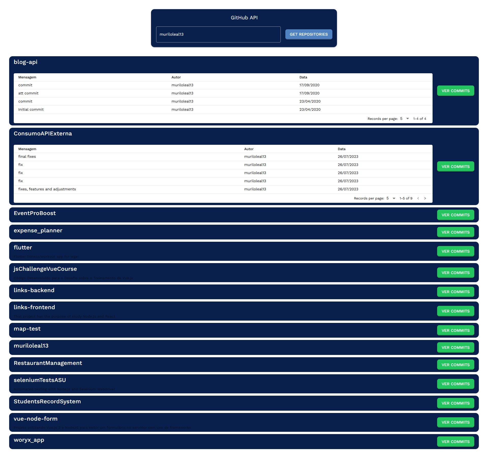

# Projeto2a: GitHub API e DOM Manipulation

#### Deploy

[Preencha aqui a URL para acesso ao site publicado](https://github-api-murilo.netlify.app)

#### Desenvolvedor(a)

Murilo Leal

#### Ambiente de desenvolvimento

- VS Code
- Vue.js 3
- Quasar Framework

#### Bastidores

Foram criadas as requisições para a api utilizando um token para não haver problema de bloqueio por múltiplas consultas

---

Projeto entregue para a disciplina de [Desenvolvimento de Software para a Web](http://github.com/andreainfufsm/elc1090-2025a) em 2025a
